# Una oferta distinta para cada cliente. Un email que debía funcionar para todos.

## Navegación

- Rodrigo Aquije
- Caso de estudio · BBVA Perú
- Discover
- Define
- Develop
- Deliver
- Activar sonido
- Desactivar sonido
- Sonido apagado
- Sonido activo
- Cambiar tema
- Modo oscuro
- Modo claro
- Cambiar idioma
- View in English
- ES
- Abrir navegación
- Cerrar navegación

## Contexto & problema de negocio

BBVA Perú · UX para email · 2025

Durante tres meses diseñé una campaña de mailing para Préstamos de Libre Disponibilidad de BBVA Perú desde Amsterdam. La pieza debía presentar una oferta de crédito variable, adaptarse a cinco perfiles y funcionar desde una sola estructura en Salesforce Marketing Cloud.

Mi responsabilidad cubrió la arquitectura de información, el diseño visual, el comportamiento responsive, la personalización mediante AMPscript y el testing previo al envío. Trabajé dentro del sistema visual de BBVA y de las restricciones regulatorias y técnicas del canal.

Este caso reconstruye una campaña real. Los datos visibles fueron anonimizados y los resultados comerciales se omiten por confidencialidad.

### Ficha del proyecto

- Rol: Diseñador UX
- Agencia: Amsterdam
- Cliente: BBVA Perú
- Producto: Préstamos de Libre Disponibilidad
- Duración: 3 meses
- Herramientas: Figma y Salesforce Marketing Cloud
- Estado: Campaña finalizada

### El problema

La campaña debía comunicar una oferta personalizada sin construir cinco emails independientes. Cambiaban el perfil, el mensaje, la imagen, el monto y algunos argumentos; la acción principal, los beneficios y el bloque regulatorio debían permanecer consistentes.

El problema de diseño era ordenar esas variables para que cada destinatario pudiera identificar cuatro cosas durante una lectura rápida:

1. por qué recibía el email;
2. qué monto tenía disponible;
3. qué debía hacer a continuación;
4. dónde consultar las condiciones de la oferta.

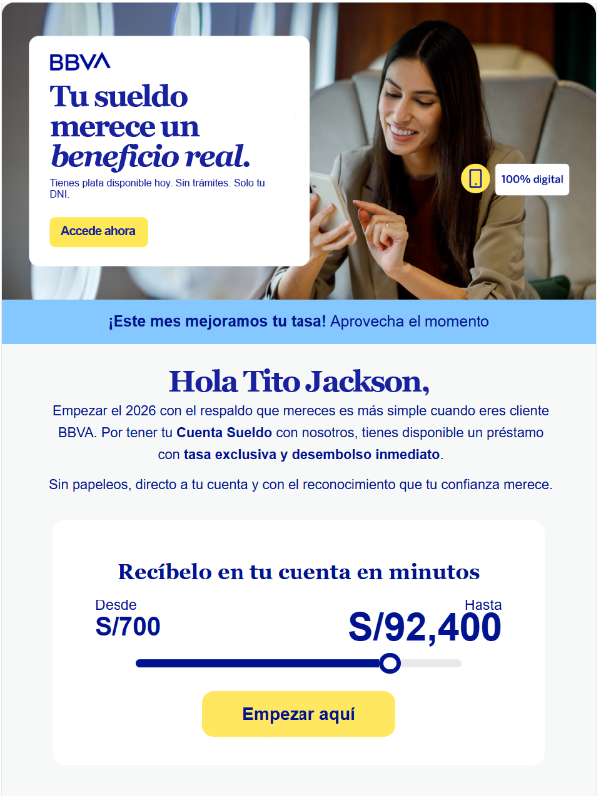

## Restricciones & trade-offs

### Sistema visual cerrado

Tipografía, paleta, componentes y espaciados respondían al sistema global de BBVA. Mi margen de decisión estaba en la composición, la jerarquía, el contenido y la forma de combinar los módulos existentes.

### Información regulatoria obligatoria

La tasa, las condiciones y los textos legales debían permanecer disponibles e íntegros. Mi decisión se limitó a ordenar su presentación dentro del email.

### Cinco perfiles, una implementación

Construir una pieza por segmento habría multiplicado el mantenimiento y el riesgo de inconsistencias. Decidí conservar una estructura común y cambiar mediante AMPscript los bloques necesarios para cada perfil.

### Restricciones técnicas del email

El email debía responder en clientes y tamaños de pantalla con motores de render distintos. Lo construí con HTML basado en tablas y CSS compatible con email, un entorno donde JavaScript y muchas interacciones web no están disponibles.

### Mobile como requisito de base

[Litmus identifica el móvil como el entorno principal de lectura para la mayoría de sus audiencias globales](https://www.litmus.com/email-client-market-share) y advierte que cada base puede comportarse de forma diferente. Sin un desglose público específico de BBVA, definí el responsive como requisito técnico desde el inicio.

## Proceso & decisiones clave

### Cómo organicé el trabajo

Agrupo el proceso en las cuatro fases de Double Diamond. Durante los tres meses recibí observaciones, ajusté el diseño, envié pruebas y corregí problemas antes de publicar la campaña.

### Discover · Entender el sistema

Revisé el brief, el producto, las variables disponibles y las restricciones de marca y compliance. También identifiqué qué contenido debía permanecer estable y qué elementos cambiarían para cada segmento.

El mapa de requisitos quedó así:

- datos personalizados por registro;
- cinco perfiles de comunicación;
- una acción comercial principal;
- beneficios comunes;
- canales alternativos;
- condiciones regulatorias completas;
- compatibilidad mobile y desktop.

### Define · Ordenar antes de diseñar

Antes de trabajar la dirección visual, organicé la campaña mediante blockframes en Figma. Los blockframes fijaron la secuencia, la proporción y la dependencia entre módulos antes de revisar color y tipografía.

Definí este orden:

1. banner contextual para reconocer el perfil;
2. franja de vigencia o beneficio comercial;
3. saludo y argumento personalizado;
4. monto disponible y CTA;
5. beneficios del préstamo;
6. canales alternativos;
7. bloque de TCEA, requisitos y condiciones.

#### Patrones de lectura como referencia

Usé el recorrido en Z como heurística para relacionar marca, propuesta y CTA dentro del banner. En los bloques de texto tomé como referencia el escaneo en F: coloqué conceptos clave al inicio de titulares y párrafos y dividí el contenido para evitar una pared de texto.

[Nielsen Norman Group señala que el patrón F puede aparecer tanto en desktop como en mobile](https://www.nngroup.com/articles/f-shaped-pattern-reading-web-content/). Su investigación también documenta otros recorridos de lectura. Apliqué encabezados, módulos breves y palabras clave al inicio para facilitar el escaneo sin imponer una trayectoria única.

### Develop · Diseñar un sistema de variaciones

Definí un cuerpo común para la oferta y limité las variaciones al contexto de cada segmento.

#### Un banner para cada perfil

Diseñé cinco aperturas que modificaban imagen, titular, argumento y CTA según el segmento. La estructura posterior conservaba la misma lógica para que la personalización no fragmentara la implementación.

#### El monto como punto de decisión

Convertí el rango disponible en el centro del módulo comercial. El indicador estático relaciona el monto mínimo con el máximo personalizado y conduce hacia el CTA “Empezar aquí”. Su función es comunicar disponibilidad dentro de las restricciones estáticas del email.

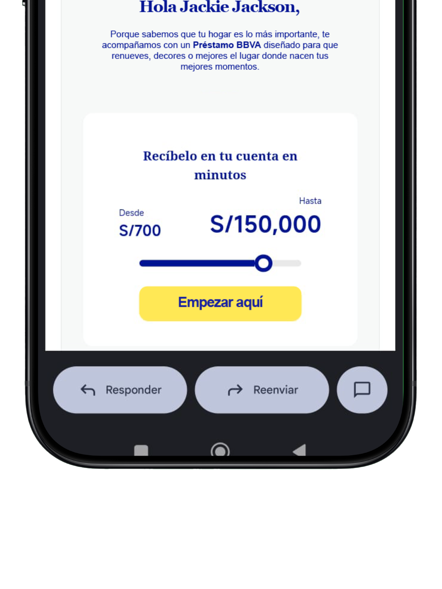

#### Compliance visible sin competir con la oferta

Separé el bloque regulatorio del módulo comercial para evitar que todos los niveles de información compitieran en el primer vistazo. La tasa y las condiciones permanecieron completas y accesibles dentro de la misma pieza.

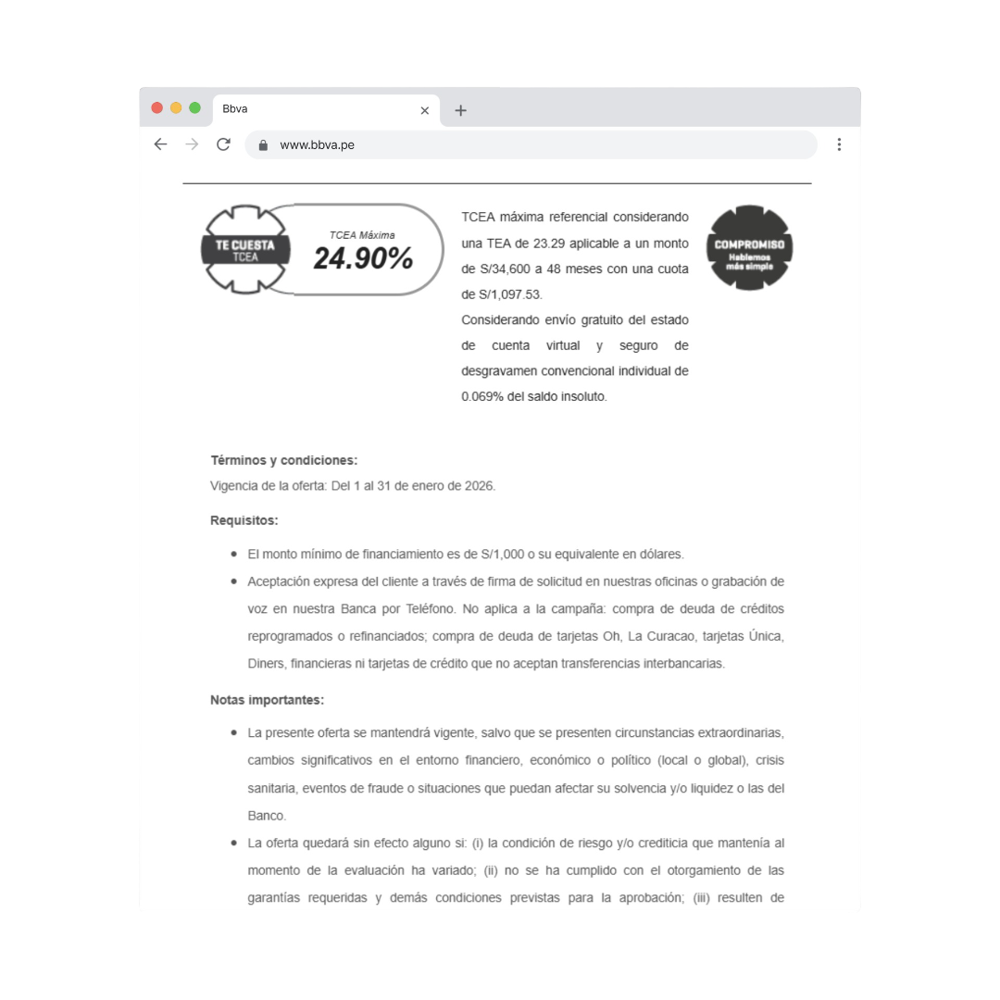

## Solución & UX writing

### Variantes por segmento

El sistema adapta la apertura del email al contexto de cada perfil. Los nombres y montos que aparecen a continuación están anonimizados.

#### 1. Estabilidad · Cuenta Sueldo

- Enfoque: reconocer la relación existente con el banco.
- Titular: “Tu sueldo merece un beneficio real”.
- CTA: “Accede ahora”.
- Imagen: reutiliza la captura principal del caso.

#### 2. Experiencias · Viajes y ocio

- Enfoque: presentar la liquidez como medio para financiar una experiencia pendiente.
- Titular: “Tus próximas aventuras empiezan hoy”.
- CTA: “Planifica tu viaje”.

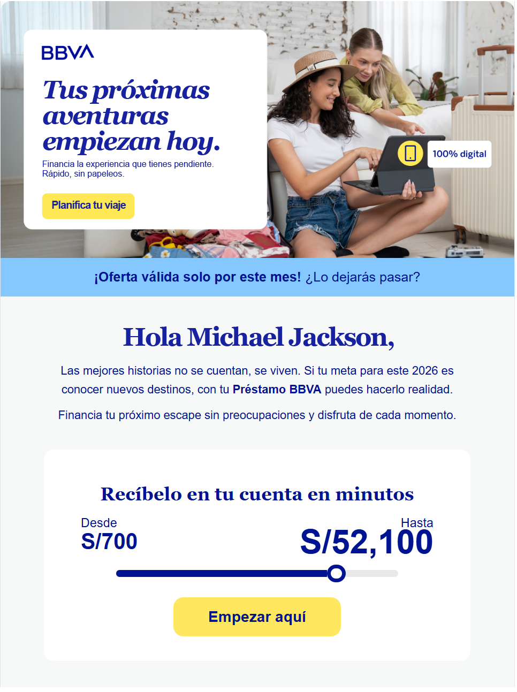

#### 3. Formación · Desarrollo profesional

- Enfoque: relacionar la oferta con estudios y crecimiento profesional.
- Titular: “Invierte en lo que más importa: tú”.
- CTA: “Empieza a crecer”.

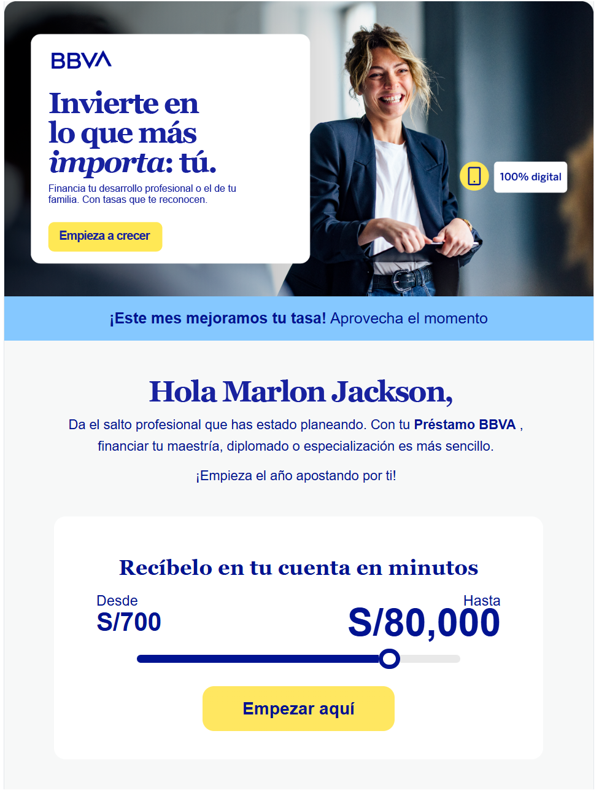

#### 4. Hogar · Mejora del espacio

- Enfoque: conectar el préstamo con una mejora concreta del hogar.
- Titular: “Tu hogar, tal como lo imaginas”.
- CTA: “Mejora tu hogar”.

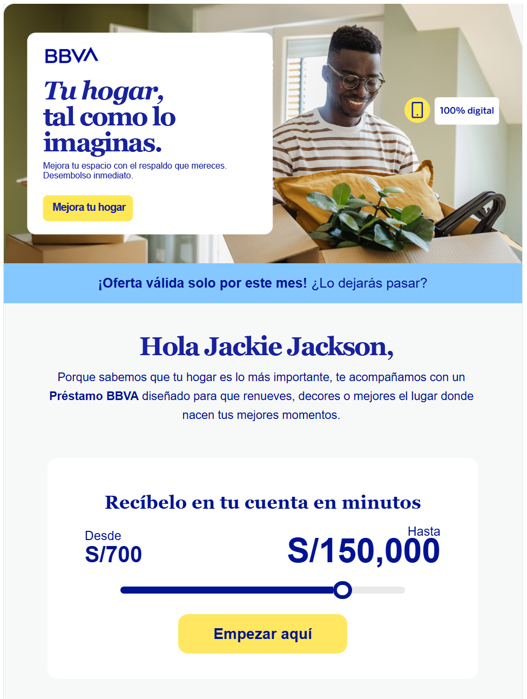

#### 5. Emprendimiento · Actividad independiente

- Enfoque: presentar la liquidez como apoyo para continuar una actividad ya iniciada.
- Titular: “Haz crecer lo que ya construiste”.
- CTA: “Impulsa tu negocio”.

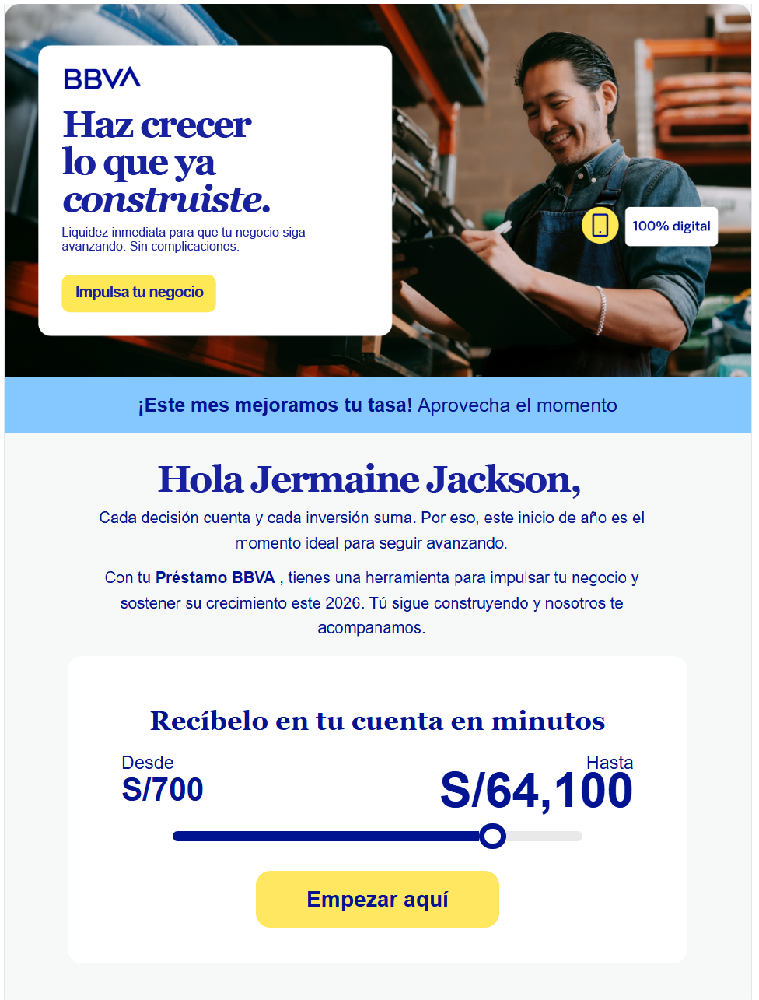

## Deliver · Implementación y testing

### Personalización mediante AMPscript

Construí una sola implementación y configuré con AMPscript las variaciones de segmento. Banner, saludo, argumento, monto y otros datos se completaban según el registro; los beneficios, canales y condiciones compartían la misma base.

Mantuve un único template para los cinco segmentos, con la misma estructura comercial y regulatoria.

### Responsive

En desktop, los beneficios podían mostrarse en una fila de tres columnas. En mobile, las mismas tarjetas se apilaban para conservar tamaño de texto, separación y área táctil.

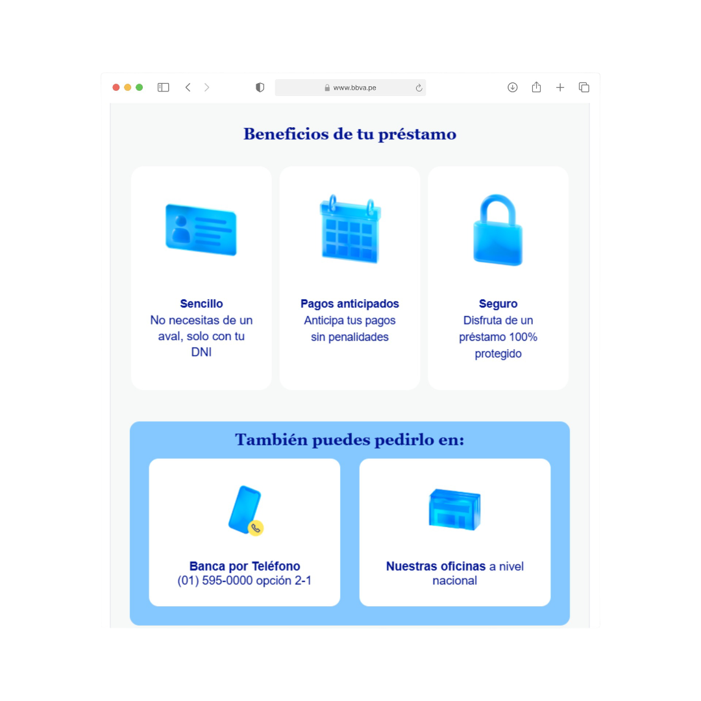

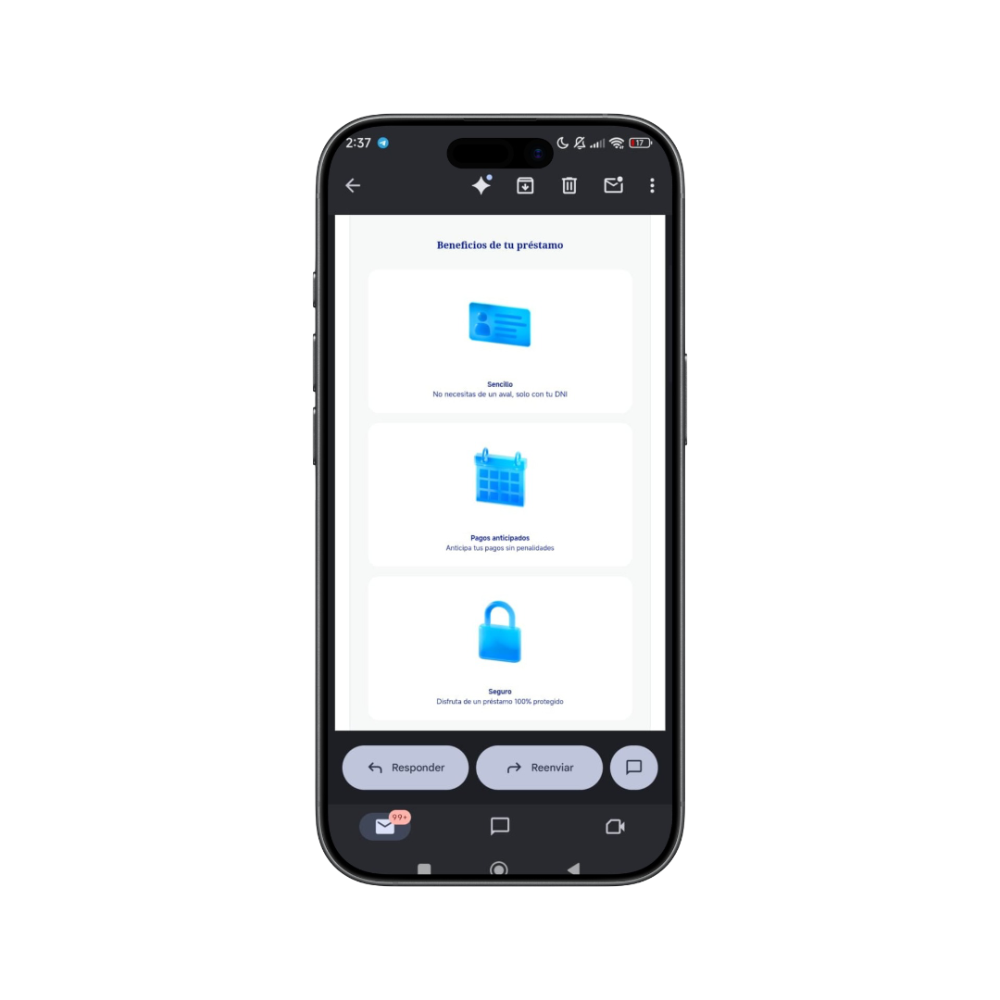

### Testing multicliente

Antes del envío realicé pruebas de contenido dinámico, enlaces, responsive y render. Revisé que nombres, montos y condiciones correspondieran al registro y que la jerarquía se mantuviera en mobile y desktop.

El testing se concentró en fallos que aparecen al ejecutar el email con datos y motores de render distintos.

### Modo claro y oscuro

Los clientes de correo pueden transformar automáticamente fondos, textos e imágenes al activar dark mode. Probé la campaña en ambos entornos y ajusté contraste y assets para mantener la información legible dentro de ese comportamiento.

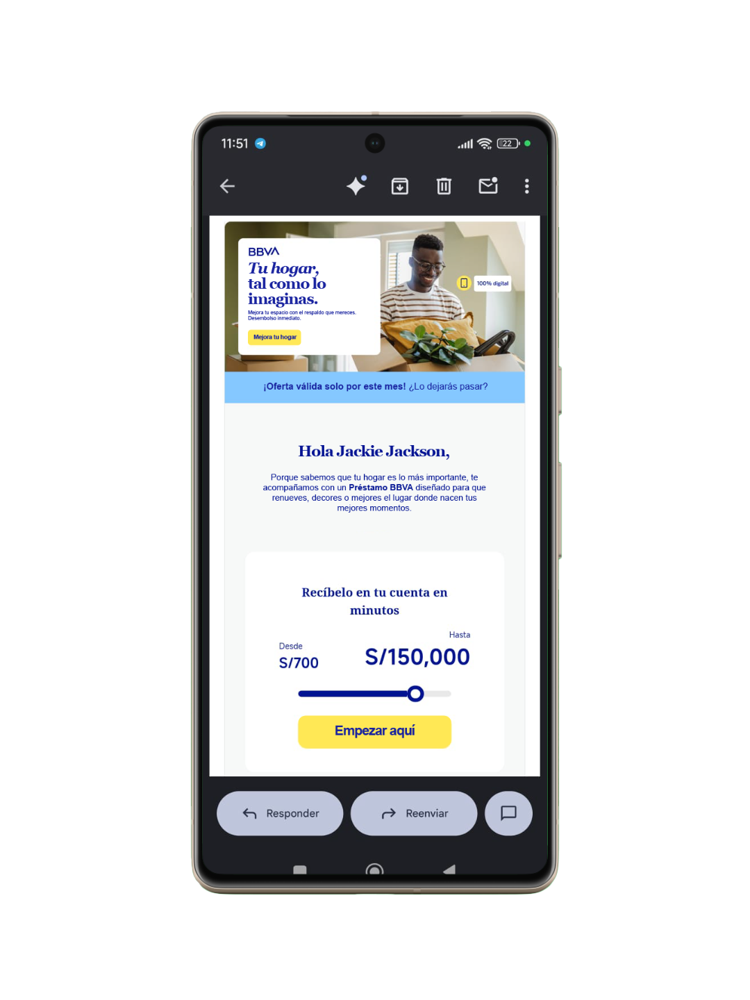

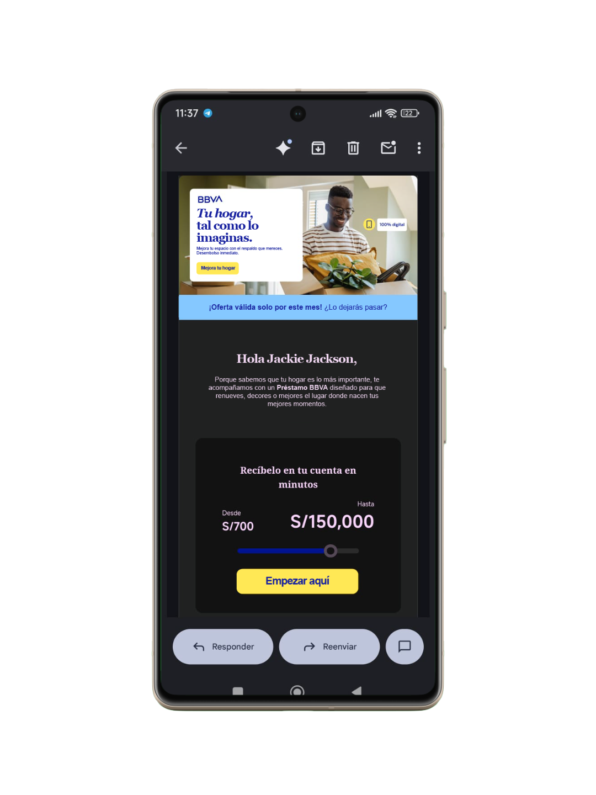

## Impacto & medición

### Una campaña implementada para cinco segmentos

La campaña fue configurada, probada y enviada desde Salesforce Marketing Cloud. Una sola estructura soportó cinco aperturas personalizadas, montos variables, responsive y el bloque regulatorio completo.

Mantengo los resultados comerciales en reserva por confidencialidad. El siguiente marco muestra cómo se evaluó la campaña:

```text
Alcance             Lectura          Respuesta          Conversión              Valor
Enviados      →      OR       →       CTOR       →      Altas · Efectividad  →  Facturación · Ticket promedio
```

### Enviados

Define el tamaño de la base impactada y permite leer el resto de indicadores sobre un alcance concreto.

### OR · Open Rate

Mide aperturas y ayuda a evaluar asunto, remitente y preview text. Interpreté esta señal por separado del diseño del cuerpo del email.

### CTOR · Click-to-Open Rate

Relaciona clics con aperturas y permite observar si la jerarquía, el contenido y el CTA movilizaron a quienes llegaron a ver la pieza.

### Altas

Registra las conversiones comerciales asociadas a la campaña dentro del modelo de medición del banco.

### Efectividad

Expresa la conversión sobre el universo definido internamente para la campaña. La fórmula y el resultado permanecen bajo confidencialidad.

### Facturación

Representa el volumen económico generado por las altas atribuidas a la campaña.

### Ticket promedio

Permite observar el valor promedio asociado a cada alta y evita evaluar el desempeño únicamente por cantidad de conversiones.

## Aprendizajes

### El email exigió decisiones de UX concretas

En este email apliqué arquitectura de información, UX writing, personalización, responsive y testing sobre HTML basado en tablas, datos dinámicos y motores de render distintos.

### Cinco variantes necesitan reglas compartidas

Antes de configurar AMPscript definí las variables de cada segmento y los módulos que compartirían la misma estructura. Esa separación mantuvo la personalización dentro de una pieza controlable.

### El render cambió según el cliente de correo

Validé el diseño con contenido real, distintos tamaños y las transformaciones de cada cliente de correo. Varias correcciones surgieron durante esas pruebas, después de cerrar la propuesta en Figma.

### Qué haría diferente hoy

Documentaría desde el inicio una matriz con componente, variable, segmento y cliente de correo. También definiría junto con producto el plan de medición antes de diseñar las variantes, para conectar cada hipótesis de contenido con una señal concreta del funnel.

## Siguiente caso

### Yape

¿Qué haces cuando Yape no puede confirmar si tu dinero llegó?

Propuesta conceptual para comunicar la espera, evitar interpretaciones equivocadas y ofrecer una siguiente acción clara.

- UX Audit
- Estados transaccionales
- Microcopy

CTA: Ver caso

Enlace: /casos/yape

## Pie de página

- © 2026 Rodrigo Aquije
- Diseñado y construido en Lima.
- Email
- LinkedIn
